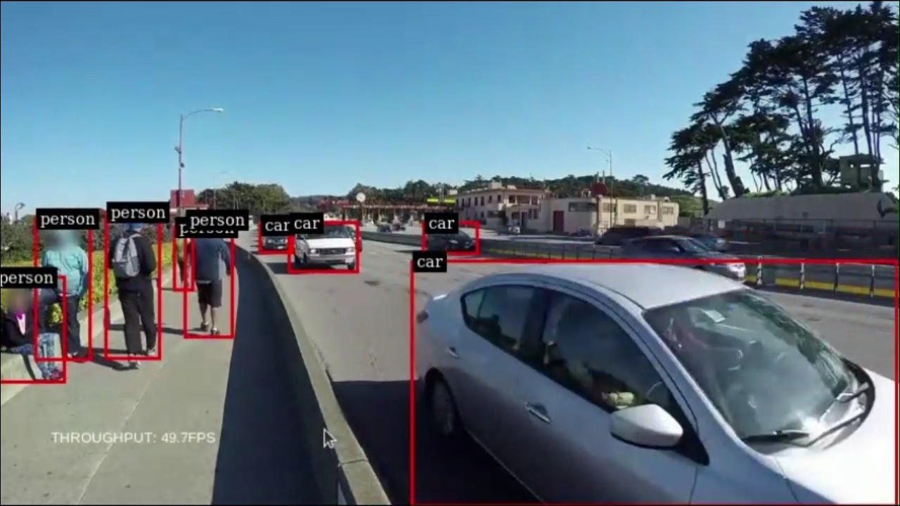

This project provides example implementations of an inference pipeline for a real-time video analytics application using OpenCV, Roboflow InferencePipeline and Nvidia Deepstream SDK.



This project was originally developed on a Nvidia Jetson AGX Xavier running Jetpack 5.1.4, Ubuntu 20.04, Deepstream SDK 6.3 in Python 3.8 using Deepstream Python bindings.

To run:

Note: Inference-gpu is dependent on onnxruntime-gpu, which may have to be installed separately from [here](https://elinux.org/Jetson_Zoo#ONNX_Runtime)
Note: Deepstream Python bindings cannot be installed in virtual environments as they rely on system packages on the Jetson device

```
# download dependencies
pip3 install -r requirements.txt
python3 inferencepipeline.py / opencvcapture.py / deepstream_app.py
```
